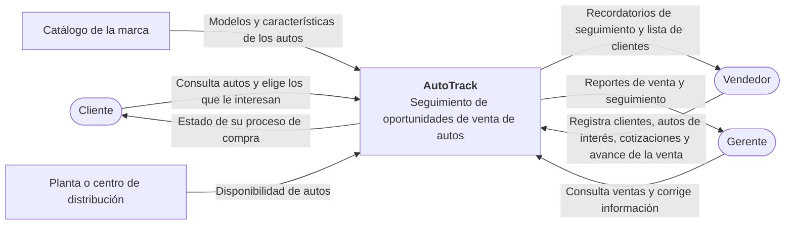
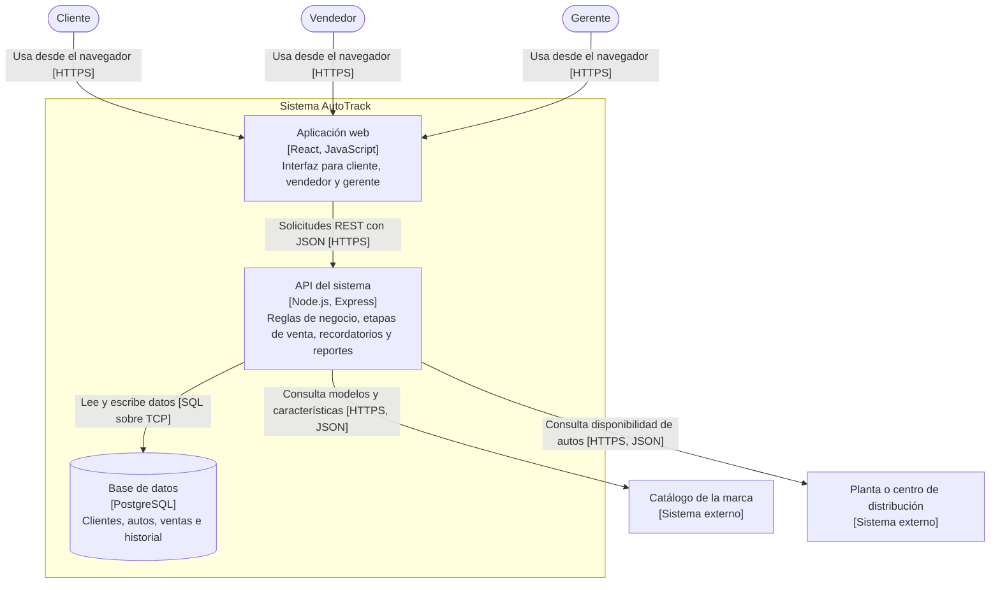
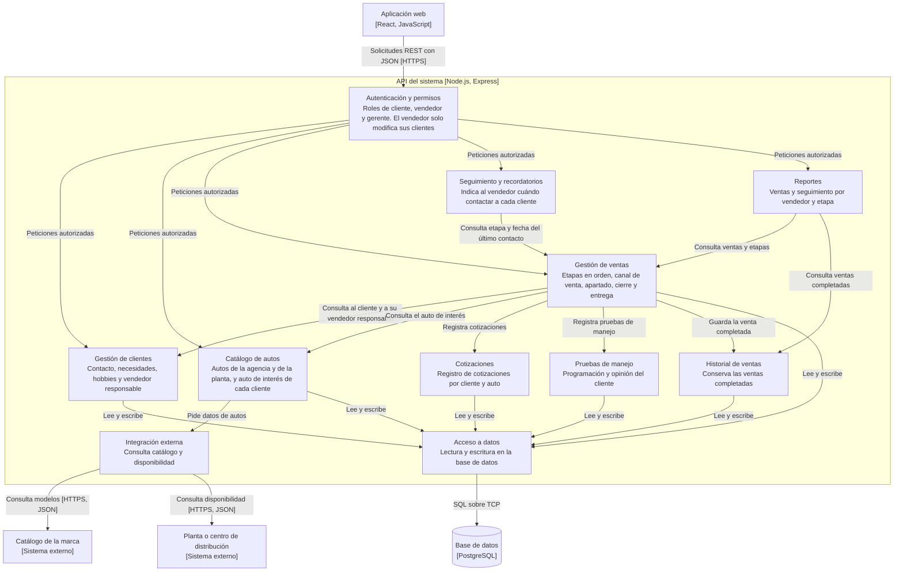

```mermaid
flowchart LR
    %% Personas
    Cliente(["Cliente"])
    Vendedor(["Vendedor"])
    Gerente(["Gerente"])

    %% Sistema como una sola caja
    AutoTrack["<b>AutoTrack</b><br/>Seguimiento de oportunidades de venta de autos"]

    %% Sistemas externos
    Marca["Catálogo de la marca"]
    Planta["Planta o centro de distribución"]

    %% Cliente
    Cliente -->|"Consulta autos y elige los que le interesan"| AutoTrack
    AutoTrack -->|"Estado de su proceso de compra"| Cliente

    %% Vendedor
    Vendedor -->|"Registra clientes, autos de interés, cotizaciones y avance de la venta"| AutoTrack
    AutoTrack -->|"Recordatorios de seguimiento y lista de clientes"| Vendedor

    %% Gerente
    Gerente -->|"Consulta ventas y corrige información"| AutoTrack
    AutoTrack -->|"Reportes de venta y seguimiento"| Gerente

    %% Sistemas externos
    Marca -->|"Modelos y características de los autos"| AutoTrack
    Planta -->|"Disponibilidad de autos"| AutoTrack
```

```mermaid
flowchart TB
    Cliente(["Cliente"])
    Vendedor(["Vendedor"])
    Gerente(["Gerente"])

    subgraph AutoTrack["Sistema AutoTrack"]
        Web["Aplicación web<br/>[React, JavaScript]<br/>Interfaz para cliente, vendedor y gerente"]
        API["API del sistema<br/>[Node.js, Express]<br/>Reglas de negocio, etapas de venta, recordatorios y reportes"]
        BD[("Base de datos<br/>[PostgreSQL]<br/>Clientes, autos, ventas e historial")]
    end

    Marca["Catálogo de la marca<br/>[Sistema externo]"]
    Planta["Planta o centro de distribución<br/>[Sistema externo]"]

    Cliente -->|"Usa desde el navegador [HTTPS]"| Web
    Vendedor -->|"Usa desde el navegador [HTTPS]"| Web
    Gerente -->|"Usa desde el navegador [HTTPS]"| Web

    Web -->|"Solicitudes REST con JSON [HTTPS]"| API
    API -->|"Lee y escribe datos [SQL sobre TCP]"| BD
    API -->|"Consulta modelos y características [HTTPS, JSON]"| Marca
    API -->|"Consulta disponibilidad de autos [HTTPS, JSON]"| Planta
```

```mermaid
flowchart TB
    Web["Aplicación web<br/>[React, JavaScript]"]
    BD[("Base de datos<br/>[PostgreSQL]")]
    Marca["Catálogo de la marca<br/>[Sistema externo]"]
    Planta["Planta o centro de distribución<br/>[Sistema externo]"]

    subgraph API["API del sistema [Node.js, Express]"]
        Auth["Autenticación y permisos<br/>Roles de cliente, vendedor y gerente. El vendedor solo modifica sus clientes"]
        Clientes["Gestión de clientes<br/>Contacto, necesidades, hobbies y vendedor responsable"]
        Catalogo["Catálogo de autos<br/>Autos de la agencia y de la planta, y auto de interés de cada cliente"]
        Ventas["Gestión de ventas<br/>Etapas en orden, canal de venta, apartado, cierre y entrega"]
        Cotizaciones["Cotizaciones<br/>Registro de cotizaciones por cliente y auto"]
        Pruebas["Pruebas de manejo<br/>Programación y opinión del cliente"]
        Seguimiento["Seguimiento y recordatorios<br/>Indica al vendedor cuándo contactar a cada cliente"]
        Historial["Historial de ventas<br/>Conserva las ventas completadas"]
        Reportes["Reportes<br/>Ventas y seguimiento por vendedor y etapa"]
        Integracion["Integración externa<br/>Consulta catálogo y disponibilidad"]
        Datos["Acceso a datos<br/>Lectura y escritura en la base de datos"]
    end

    Web -->|"Solicitudes REST con JSON [HTTPS]"| Auth

    Auth -->|"Peticiones autorizadas"| Clientes
    Auth -->|"Peticiones autorizadas"| Catalogo
    Auth -->|"Peticiones autorizadas"| Ventas
    Auth -->|"Peticiones autorizadas"| Seguimiento
    Auth -->|"Peticiones autorizadas"| Reportes

    Ventas -->|"Consulta al cliente y a su vendedor responsable"| Clientes
    Ventas -->|"Consulta el auto de interés"| Catalogo
    Ventas -->|"Registra cotizaciones"| Cotizaciones
    Ventas -->|"Registra pruebas de manejo"| Pruebas
    Ventas -->|"Guarda la venta completada"| Historial

    Seguimiento -->|"Consulta etapa y fecha del último contacto"| Ventas
    Reportes -->|"Consulta ventas y etapas"| Ventas
    Reportes -->|"Consulta ventas completadas"| Historial

    Catalogo -->|"Pide datos de autos"| Integracion
    Integracion -->|"Consulta modelos [HTTPS, JSON]"| Marca
    Integracion -->|"Consulta disponibilidad [HTTPS, JSON]"| Planta

    Clientes -->|"Lee y escribe"| Datos
    Catalogo -->|"Lee y escribe"| Datos
    Ventas -->|"Lee y escribe"| Datos
    Cotizaciones -->|"Lee y escribe"| Datos
    Pruebas -->|"Lee y escribe"| Datos
    Historial -->|"Lee y escribe"| Datos
    Datos -->|"SQL sobre TCP"| BD
```

