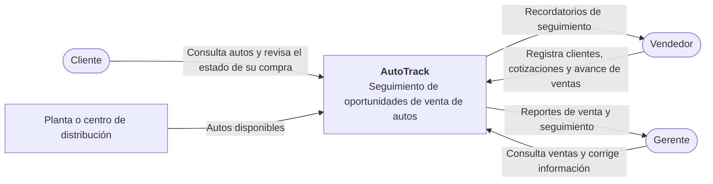
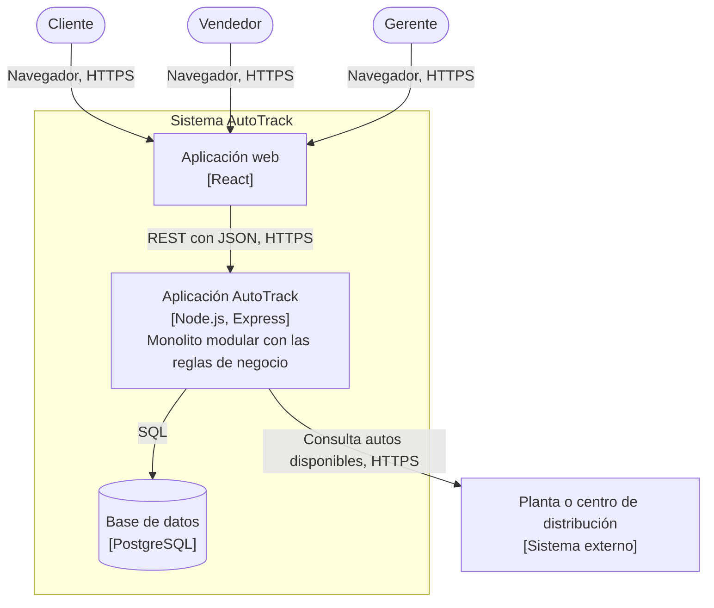
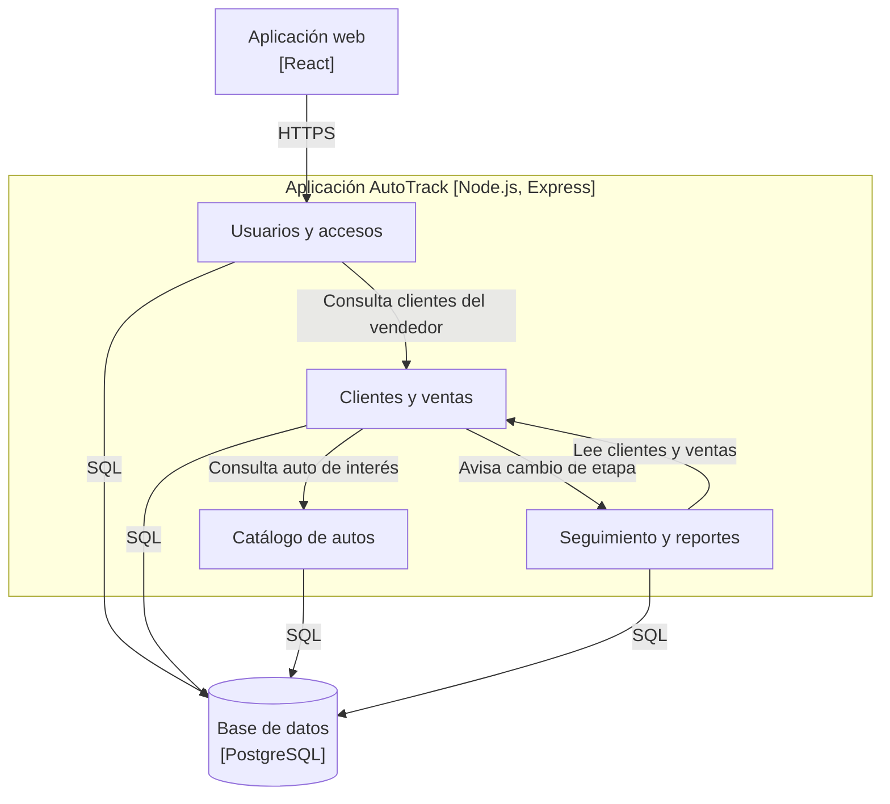

```mermaid
flowchart LR
    Cliente(["Cliente"])
    Vendedor(["Vendedor"])
    Gerente(["Gerente"])

    AutoTrack["<b>AutoTrack</b><br/>Seguimiento de oportunidades de venta de autos"]

    Planta["Planta o centro de distribución"]

    Cliente -->|"Consulta autos y revisa el estado de su compra"| AutoTrack
    Vendedor -->|"Registra clientes, cotizaciones y avance de ventas"| AutoTrack
    AutoTrack -->|"Recordatorios de seguimiento"| Vendedor
    Gerente -->|"Consulta ventas y corrige información"| AutoTrack
    AutoTrack -->|"Reportes de venta y seguimiento"| Gerente
    Planta -->|"Autos disponibles"| AutoTrack
```

```mermaid
flowchart TB
    Cliente(["Cliente"])
    Vendedor(["Vendedor"])
    Gerente(["Gerente"])

    subgraph AutoTrack["Sistema AutoTrack"]
        Web["Aplicación web<br/>[React]"]
        App["Aplicación AutoTrack<br/>[Node.js, Express]<br/>Monolito modular con las reglas de negocio"]
        BD[("Base de datos<br/>[PostgreSQL]")]
    end

    Planta["Planta o centro de distribución<br/>[Sistema externo]"]

    Cliente -->|"Navegador, HTTPS"| Web
    Vendedor -->|"Navegador, HTTPS"| Web
    Gerente -->|"Navegador, HTTPS"| Web
    Web -->|"REST con JSON, HTTPS"| App
    App -->|"SQL"| BD
    App -->|"Consulta autos disponibles, HTTPS"| Planta
```

```mermaid
flowchart TB
    Web["Aplicación web<br/>[React]"]
    BD[("Base de datos<br/>[PostgreSQL]")]

    subgraph App["Aplicación AutoTrack [Node.js, Express]"]
        Accesos["Usuarios y accesos"]
        Ventas["Clientes y ventas"]
        Catalogo["Catálogo de autos"]
        Seguimiento["Seguimiento y reportes"]
    end

    Web -->|"HTTPS"| Accesos
    Accesos -->|"Consulta clientes del vendedor"| Ventas
    Ventas -->|"Consulta auto de interés"| Catalogo
    Ventas -->|"Avisa cambio de etapa"| Seguimiento
    Seguimiento -->|"Lee clientes y ventas"| Ventas

    Accesos -->|"SQL"| BD
    Ventas -->|"SQL"| BD
    Catalogo -->|"SQL"| BD
    Seguimiento -->|"SQL"| BD
```

