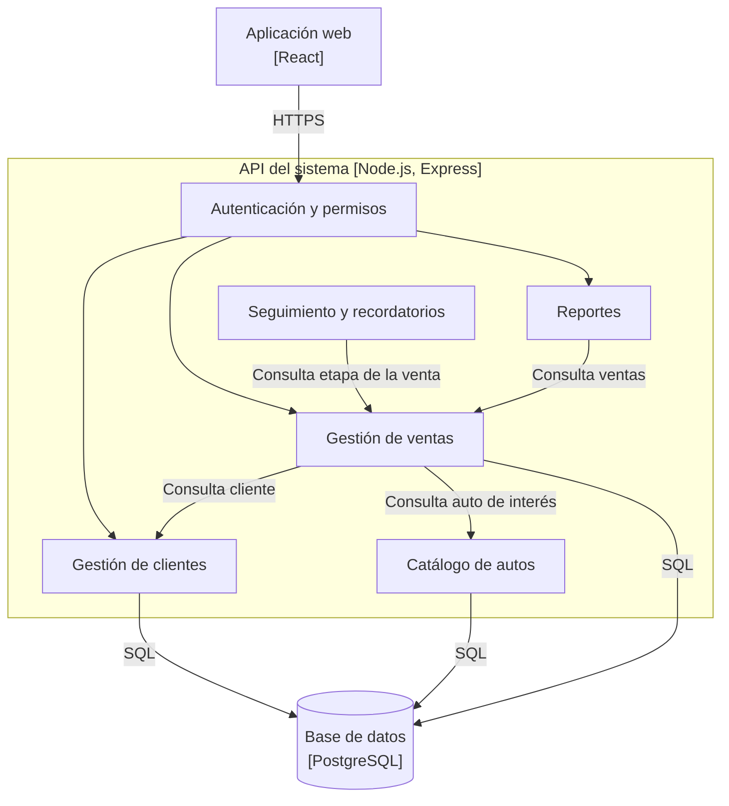

```mermaid
flowchart LR
    %% Personas
    Cliente(["Cliente"])
    Vendedor(["Vendedor"])
    Gerente(["Gerente"])

    %% Sistema como una sola caja
    AutoTrack["<b>AutoTrack</b><br/>Seguimiento de oportunidades de venta de autos"]

    %% Sistemas externos
    Marca["Catálogo de la marca"]
    Planta["Planta o centro de distribución"]

    %% Cliente
    Cliente -->|"Consulta autos y elige los que le interesan"| AutoTrack
    AutoTrack -->|"Estado de su proceso de compra"| Cliente

    %% Vendedor
    Vendedor -->|"Registra clientes, autos de interés, cotizaciones y avance de la venta"| AutoTrack
    AutoTrack -->|"Recordatorios de seguimiento y lista de clientes"| Vendedor

    %% Gerente
    Gerente -->|"Consulta ventas y corrige información"| AutoTrack
    AutoTrack -->|"Reportes de venta y seguimiento"| Gerente

    %% Sistemas externos
    Marca -->|"Modelos y características de los autos"| AutoTrack
    Planta -->|"Disponibilidad de autos"| AutoTrack
```

```mermaid
flowchart TB
    Cliente(["Cliente"])
    Vendedor(["Vendedor"])
    Gerente(["Gerente"])

    subgraph AutoTrack["Sistema AutoTrack"]
        Web["Aplicación web<br/>[React, JavaScript]<br/>Interfaz para cliente, vendedor y gerente"]
        API["API del sistema<br/>[Node.js, Express]<br/>Reglas de negocio, etapas de venta, recordatorios y reportes"]
        BD[("Base de datos<br/>[PostgreSQL]<br/>Clientes, autos, ventas e historial")]
    end

    Marca["Catálogo de la marca<br/>[Sistema externo]"]
    Planta["Planta o centro de distribución<br/>[Sistema externo]"]

    Cliente -->|"Usa desde el navegador [HTTPS]"| Web
    Vendedor -->|"Usa desde el navegador [HTTPS]"| Web
    Gerente -->|"Usa desde el navegador [HTTPS]"| Web

    Web -->|"Solicitudes REST con JSON [HTTPS]"| API
    API -->|"Lee y escribe datos [SQL sobre TCP]"| BD
    API -->|"Consulta modelos y características [HTTPS, JSON]"| Marca
    API -->|"Consulta disponibilidad de autos [HTTPS, JSON]"| Planta
```

```mermaid
flowchart TB
    Web["Aplicación web<br/>[React]"]
    BD[("Base de datos<br/>[PostgreSQL]")]

    subgraph API["API del sistema [Node.js, Express]"]
        Auth["Autenticación y permisos"]
        Clientes["Gestión de clientes"]
        Catalogo["Catálogo de autos"]
        Ventas["Gestión de ventas"]
        Seguimiento["Seguimiento y recordatorios"]
        Reportes["Reportes"]
    end

    Web -->|"HTTPS"| Auth
    Auth --> Clientes
    Auth --> Ventas
    Auth --> Reportes

    Ventas -->|"Consulta cliente"| Clientes
    Ventas -->|"Consulta auto de interés"| Catalogo
    Seguimiento -->|"Consulta etapa de la venta"| Ventas
    Reportes -->|"Consulta ventas"| Ventas

    Clientes -->|"SQL"| BD
    Catalogo -->|"SQL"| BD
    Ventas -->|"SQL"| BD
```

