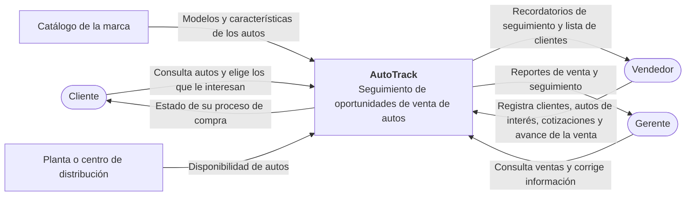

```mermaid
flowchart LR
    %% Personas
    Cliente(["Cliente"])
    Vendedor(["Vendedor"])
    Gerente(["Gerente"])

    %% Sistema como una sola caja
    AutoTrack["<b>AutoTrack</b><br/>Seguimiento de oportunidades de venta de autos"]

    %% Sistemas externos
    Marca["Catálogo de la marca"]
    Planta["Planta o centro de distribución"]

    %% Cliente
    Cliente -->|"Consulta autos y elige los que le interesan"| AutoTrack
    AutoTrack -->|"Estado de su proceso de compra"| Cliente

    %% Vendedor
    Vendedor -->|"Registra clientes, autos de interés, cotizaciones y avance de la venta"| AutoTrack
    AutoTrack -->|"Recordatorios de seguimiento y lista de clientes"| Vendedor

    %% Gerente
    Gerente -->|"Consulta ventas y corrige información"| AutoTrack
    AutoTrack -->|"Reportes de venta y seguimiento"| Gerente

    %% Sistemas externos
    Marca -->|"Modelos y características de los autos"| AutoTrack
    Planta -->|"Disponibilidad de autos"| AutoTrack
```
